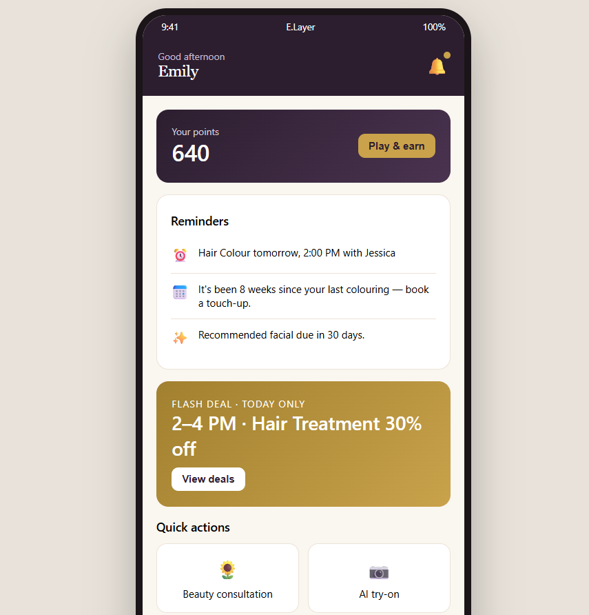
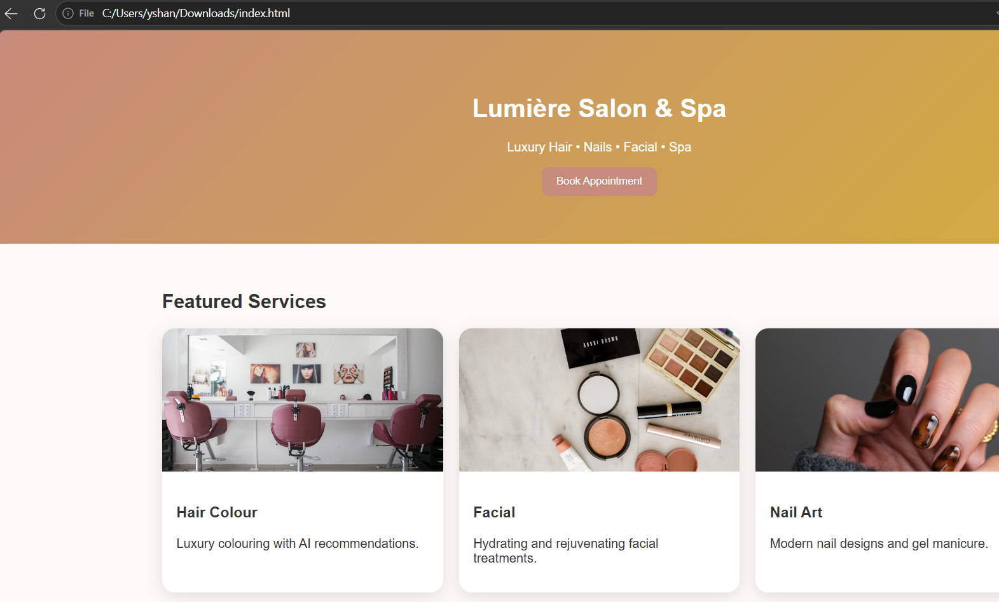
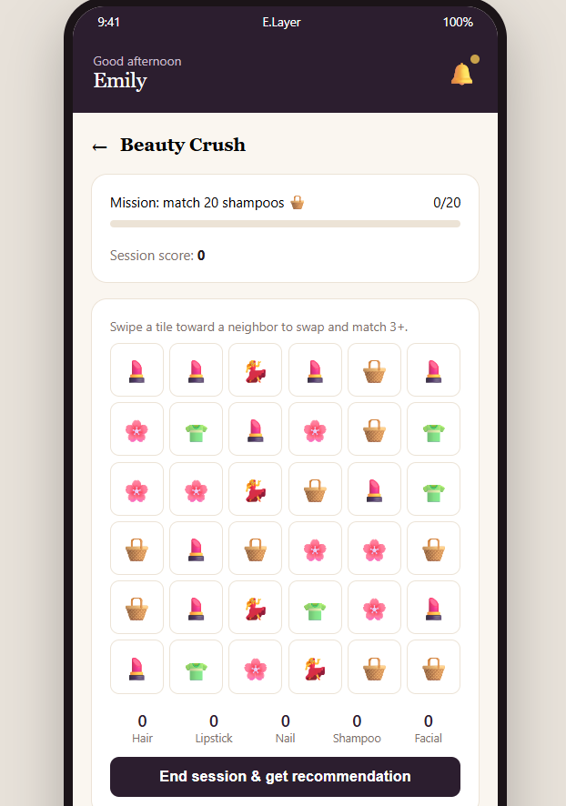
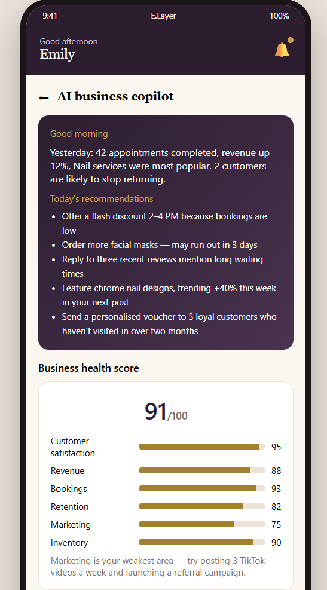

# E.Layer — Salon Booking & Business Intelligence App

A two-sided mobile app prototype built for **E.Layer Unisex Hair & Beauty Salon**,
a real heartland salon at 326 Woodlands Street 32, Singapore. Customers get
booking, rewards, an AI beauty consultation and a virtual try-on. The owner gets
a password-protected portal with a business dashboard, customer insights,
inventory alerts, and an AI Business Copilot that produces a daily briefing.

Delivered as part of an interdisciplinary project with **HECS (Heartland
Enterprise Centre Singapore)** as industry partner. I designed and built the
entire application myself.

### 🔗 [Try the live prototype →](https://e-layer.netlify.app/)

Owner portal demo password: **`owner123`**



---

## The problem

Heartland shops are the lifeblood of Singapore's residential estates — tailoring,
beauty treatments, local food, all within walking distance of home. But most
remain tethered to brick-and-mortar models with almost no digital footprint, and
customers increasingly discover businesses digitally. Limited online visibility
means less foot traffic, which means a business that slowly stagnates.

When we visited E.Layer and spoke with the owner, one thing came up that no
amount of desk research would have surfaced: **most customers assumed the shop
only did hair and nails**, and had no idea it also offered spa and facial
services. The shop's problem wasn't quality — it was that people couldn't see
what was on offer.

The owner was also tracking her business on paper. No view of which services sold,
which customers had stopped coming, or when her quiet hours actually were.

## How the solution got here

The final app is the third idea, and the path matters more than the destination.

**Idea 1 — livestream the stylists at work.** Rejected by the owner, and she was
right: most customers don't want to be filmed getting a facial or a massage.
It's a personal experience. The idea had also been done before by plenty of shops.
The real lesson was that we'd designed around what looked impressive to us rather
than what a customer would actually be comfortable with.

**Idea 2 — a website.** My teammates pushed back: customers wouldn't bother
navigating to a website. Scrapping work I'd already built wasn't comfortable, but
the friction argument was correct.



**Idea 3 — a mobile app**, with an AI business copilot for the owner and genuinely
engaging features for customers. That's what's here.

I built a working, publicly accessible prototype rather than a slide mockup —
because the owner needed to *use* it, not imagine it. That also let us test
feasibility before committing to real costs: App Store and Play Store developer
accounts run about SGD 170, and production AI try-on would need paid API access.

## Customer side

Five tabs: **Home · Book · Rewards · Try-on · Profile**

| Feature | What it does |
|---|---|
| **Online booking** | Service, stylist, date/time and confirmation flow |
| **Stylist profiles** | Photos, specialties, ratings and written reviews |
| **Service catalogue** | Full descriptions, duration and price — directly addressing the "I didn't know they did facials" problem |
| **Live price calculator** | Real-time total with add-ons and membership discount applied |
| **AI Beauty Consultation** | Multi-category questionnaire (hair, skin, nail, spa) plus lifestyle and stress questions, producing a personalised service recommendation |
| **AI try-on** | Simulated preview for nail colours and hair colours, with match confidence and upkeep information |
| **Beauty Passport** | Stamp collection unlocking a badge and voucher |
| **Beauty Journey** | Visit history timeline with progress notes |
| **Referral system** | Shareable personal code |
| **Flash deals** | Discounts targeted at off-peak slots — turning the owner's quiet hours into bookings |
| **Community feed** | Photo posts with likes |
| **Waitlist** | Queue for fully-booked slots |
| **Daily check-in streak** | Escalating point rewards |
| **Location tools** | Embedded map, copy address, get directions, share location |

### Beauty Crush



A swipe-based match-3 game built into the rewards tab. It isn't decoration — it's
tied to a shampoo-matching mission, awards loyalty points and vouchers, and
generates a product recommendation based on **which category the player matched
most**. The game is doing customer profiling while the customer is playing.

Most salon loyalty programmes only reward you *after* you spend. This one gives
someone a reason to open the app on a day they weren't going to book anything.

## Owner side

Password-protected portal, reached from the profile tab.



**Business dashboard** — daily bookings, revenue, cancellation rate, retention,
peak booking hours, most-booked service, most popular stylist.

**Customer insights** — most frequent customers, lapsed customers (90+ days since
last visit), most redeemed voucher, average spend per visit.

**Inventory** — stock list with low-stock alerts.

**AI Business Copilot** — a morning-briefing screen combining:

- A business health score
- An AI-generated promotion idea
- A churn-risk customer list with suggested actions for each
- A revenue forecast
- Review sentiment analysis
- Trending service data

The design intent is that the owner opens one screen in the morning and knows
what needs attention — replacing a paper book with something that actually tells
her something.

## How it's built

A single self-contained `index.html`: **vanilla JavaScript, no framework, no
build step, no dependencies.** 921 lines covering every screen, the match-3 game
engine, and the owner analytics.

That was a deliberate constraint. A prototype whose entire purpose is to be
opened by a non-technical shop owner on her own phone shouldn't need a toolchain
to run, and it deploys as a static file anywhere. Screens are rendered by plain
functions (`renderHome`, `renderBook`, `renderRewards`, `renderCamera`,
`renderProfile`, `renderOwner`, `renderCopilot`, `renderMatch`) swapping content
into a phone frame, with `localStorage` holding state between visits.

Deployed on **Netlify**, so it has a public URL anyone can open — no install, no
TestFlight, no app store review.

## Running it locally

There's no build step. Clone and open the file:

```bash
git clone https://github.com/shanshannnnnn/elayer-salon-app.git
```

```bash
cd elayer-salon-app
```

Then open `index.html` in any browser. For the mobile layout, use your browser's
device toolbar (F12 → toggle device toolbar) and pick a phone.

Stylist and service photos are loaded from Unsplash, so the app needs a network
connection to render them.

## Honest limitations

This is a prototype for stakeholder validation, not production software:

- **No backend.** All data is mock data held in the file and in `localStorage`.
  Nothing persists across devices and no real bookings are made.
- **The owner password is not security.** `owner123` is a constant in client-side
  JavaScript — anyone can read it by viewing source. It exists to demonstrate the
  two-sided flow, and real deployment would need server-side authentication.
- **The AI features are simulated.** The consultation, copilot and try-on produce
  scripted responses from mock data rather than calling a model. That was a cost
  decision: the point was to validate whether the owner and customers wanted these
  features before paying for API access.
- **Single salon.** Services, stylists and inventory are hardcoded for E.Layer
  rather than being configurable.

## What I'd do next

- A real backend so bookings persist and the owner dashboard reflects live data
- Server-side auth for the owner portal
- Wire the try-on to an actual image model, and the copilot to a real LLM
- Make the shop configurable so HECS could offer it to other heartland businesses,
  which was the intended expansion path

## Technologies

**Frontend** — HTML, CSS, vanilla JavaScript (no framework)
**State** — `localStorage`
**Deployment** — Netlify (static hosting), GitHub
**Design** — Mobile-first, phone-framed prototype UI

## Context

Built for an interdisciplinary project with a five-person team drawn from
engineering, media, nursing, and early childhood education, partnered with HECS.
The team handled research, business modelling and the implementation plan; the
application itself was designed and built solely by me.

## License

MIT — see [LICENSE](LICENSE).

_E.Layer is a real business. It is named here with permission of the repository
author, who worked with the salon directly. The salon's branding and details are
included for portfolio context only._
